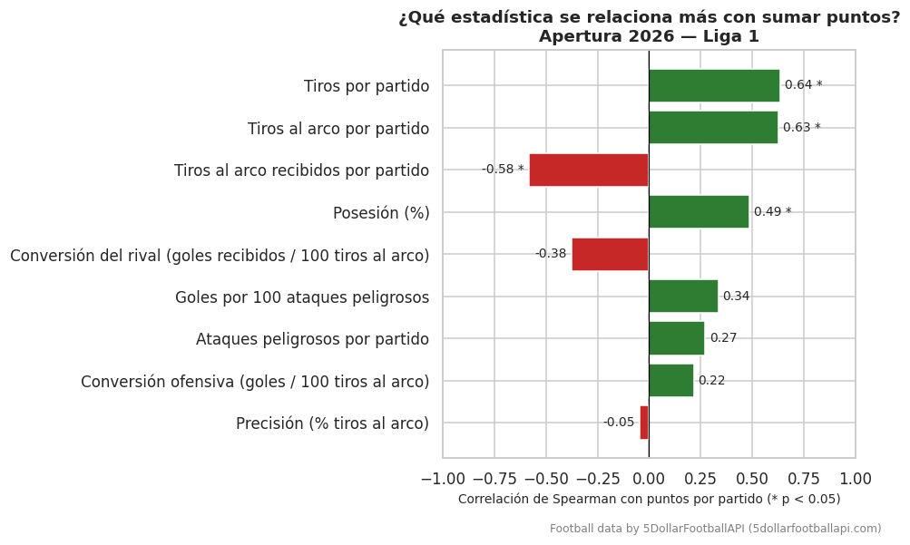
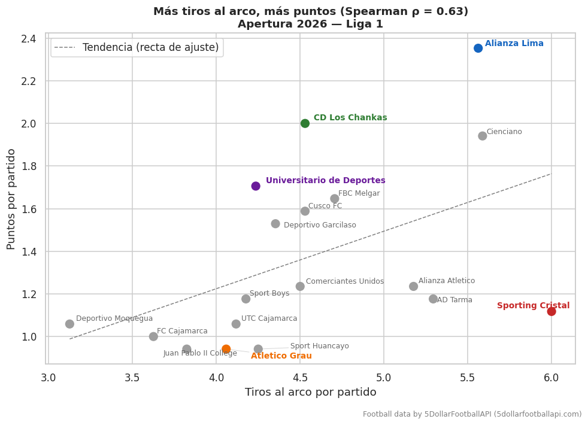
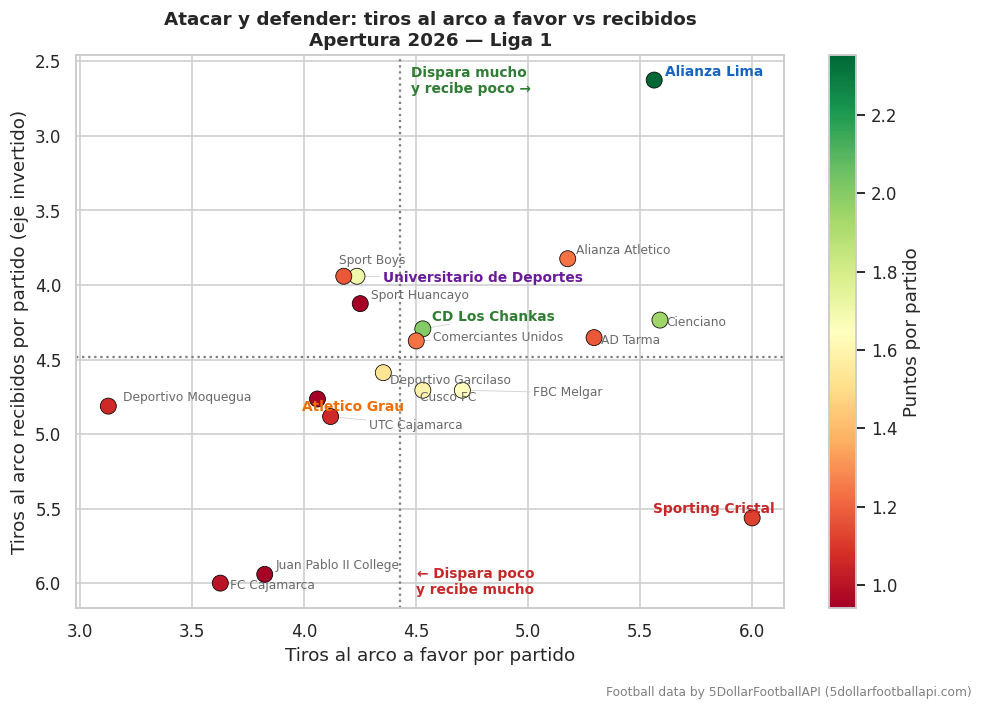
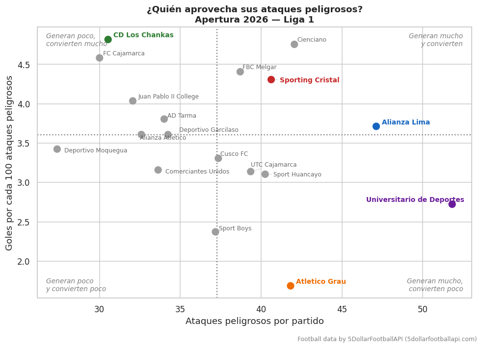

# ⚽ Dominar no es ganar — Eficiencia en el Torneo Apertura 2026 (Liga 1, Perú)

> **Football data by [5DollarFootballAPI](https://5dollarfootballapi.com)**

¿Qué se relaciona más con sumar puntos en el fútbol peruano: tener la pelota, generar ataques peligrosos, disparar mucho o no dejar disparar? Este proyecto analiza los **153 partidos del Torneo Apertura 2026 de la Liga 1** para responderlo.

---

## 📌 Resultados principales

- **El volumen de tiros es lo que más se relaciona con los puntos**: tiros por partido (ρ = 0.64) y tiros al arco por partido (ρ = 0.63).
- **La defensa pesa casi lo mismo**: los tiros al arco recibidos por partido tienen una correlación de ρ = −0.58 con los puntos.
- **Generar no basta**: los ataques peligrosos (ρ = 0.27), la conversión (ρ = 0.22) y la precisión (ρ = −0.05) casi no se relacionan con los puntos.
- **Sporting Cristal** tuvo la mayor posesión (58.2%) y la mayor cantidad de tiros al arco por partido (6.0) del torneo, pero terminó 12° con 19 puntos: recibió 5.6 tiros al arco por partido.
- **Alianza Lima** fue el que más puntos sumó (40) y el que menos tiros al arco recibió (2.6 por partido): solo 8 goles en contra en 17 partidos.

**En el Apertura 2026 no ganó el que más dominó, sino el que más disparó… y el que menos dejó disparar.**

---

## 🗂️ Archivos del repositorio

```
├── README.md
├── eficiencia_Apertura2026.ipynb             
├── correlaciones_con_puntos.png
├── tiros_al_arco_vs_puntos.png
├── tiros_a_favor_vs_recibidos.png
└── ataques_peligrosos_vs_eficiencia.png
```

---

## 📥 Datos

| Aspecto | Detalle |
|---|---|
| Fuente | [5DollarFootballAPI](https://5dollarfootballapi.com) — endpoint `/v1/leagues/{id}/fixtures` con `include=events,stats` |
| Liga | Peru Liga 1 |
| Periodo | Torneo Apertura 2026: del 30/01/2026 al 31/05/2026 (hora de Lima) |
| Partidos | 153 (18 equipos × 17 partidos, una sola rueda) |

El análisis parte de una tabla de partidos ya limpia y validada. El proceso de descarga y limpieza se hizo por separado y **no está incluido en este repositorio**.

---

## 🧹 Limpieza y validación (resumen)

Antes del análisis, los datos de la API se validaron partido por partido:

- Se seleccionaron los partidos dentro de las fechas del Apertura y se verificó que fueran 18 equipos con 17 partidos cada uno (153 cruces únicos).
- Se excluyó un partido duplicado en el calendario de la API, con estado sin confirmar y un cruce que ya se había jugado.
- 3 partidos tenían el bloque de estadísticas roto (0 ataques en ambos equipos y tiros al arco iguales a los goles). Se marcaron con la bandera `stats_validas = False` y quedaron fuera de las métricas de juego.
- En los eventos se encontraron un gol registrado de más y tarjetas amarillas incompletas en algunos partidos. Los totales de goles, córners y tarjetas se tomaron de la tabla de partidos, que coincide con los resultados reales.

---

## 🔬 Metodología

**Muestras**
- **Puntos y goles**: los 153 partidos.
- **Posesión, ataques y tiros**: los 150 partidos con estadísticas válidas. Las métricas se calculan **por partido**, para que los equipos con un partido excluido sean comparables.

**Métricas por equipo**

| Métrica | Cálculo |
|---|---|
| Puntos por partido | Puntos / partidos jugados |
| Tiros por partido | (Tiros al arco + tiros desviados) / partidos |
| Precisión | Tiros al arco / tiros totales × 100 |
| Conversión ofensiva | Goles / tiros al arco × 100 |
| Goles por 100 ataques peligrosos | Goles / ataques peligrosos × 100 |
| Tiros al arco recibidos | Tiros al arco del rival / partidos |
| Conversión del rival | Goles recibidos / tiros al arco del rival × 100 |

En los 300 registros equipo-partido válidos no hubo ningún caso con más goles que tiros al arco, lo que es consistente con que los goles cuentan como tiro al arco.

**Pruebas estadísticas**
- **Correlación de Spearman** entre cada métrica y los puntos por partido (n = 18 equipos). Se eligió Spearman por el tamaño de muestra pequeño y su robustez ante valores extremos.
- **Corrección de Bonferroni** por comparaciones múltiples: con 9 pruebas, el umbral es α = 0.05 / 9 ≈ 0.0056.

---

## 📊 Análisis

### 1. ¿Qué estadística se relaciona más con sumar puntos?



| Métrica | ρ de Spearman | p-valor |
|---|---|---|
| Tiros por partido | 0.636 | 0.005 |
| Tiros al arco por partido | 0.628 | 0.005 |
| Tiros al arco recibidos por partido | −0.584 | 0.011 |
| Posesión (%) | 0.487 | 0.040 |
| Conversión del rival | −0.377 | 0.123 |
| Goles por 100 ataques peligrosos | 0.336 | 0.173 |
| Ataques peligrosos por partido | 0.272 | 0.274 |
| Conversión ofensiva | 0.218 | 0.386 |
| Precisión | −0.048 | 0.851 |

Las métricas de **volumen** (cuánto disparas y cuánto te disparan) son las que más se relacionan con los puntos. La posesión tiene una relación moderada. La calidad de la definición (precisión y conversión) prácticamente no se relaciona con los puntos en este torneo.

Con la corrección de Bonferroni, solo tiros por partido y tiros al arco por partido quedan por debajo del umbral, en el límite. Con 18 equipos, estos resultados deben leerse como **tendencias**.

### 2. Más tiros al arco, más puntos… con una gran excepción



La mayoría de equipos sigue la tendencia: más tiros al arco, más puntos. **Sporting Cristal** es la gran excepción. Fue el equipo que más disparó al arco (6.0 por partido) y terminó 12° con 19 puntos. **Universitario** y **Los Chankas** quedan muy por encima de la recta: sumaron más puntos de lo que su volumen de tiros haría esperar.

### 3. Atacar y defender



El eje vertical está invertido: arriba están los equipos que **reciben menos** tiros. **Alianza Lima** está solo en la esquina ideal: dispara mucho (5.6 por partido) y recibe muy poco (2.6). **Sporting Cristal** dispara todavía más, pero recibe 5.6 tiros al arco por partido. Ahí se explica por qué dominar no le alcanzó.

### 4. ¿Quién aprovecha sus ataques peligrosos?



- **Universitario** es el que más ataques peligrosos genera (51.8 por partido), pero convierte solo 2.7 goles por cada 100.
- **Los Chankas** generan pocos (30.5 por partido) y convierten 4.8 goles por cada 100, el valor más alto del torneo junto a Cienciano.
- **Atlético Grau** genera bastante (41.8 por partido), pero convierte solo 1.7 goles por cada 100, el peor valor del torneo, con apenas 12 goles a favor.

### Equipos destacados

| Equipo | Pts | Pts/partido | Posesión % | Ataques pelig./partido | Tiros al arco/partido | Tiros al arco recibidos/partido | Goles por 100 ataques pelig. |
|---|---|---|---|---|---|---|---|
| Alianza Lima | 40 | 2.35 | 55.8 | 47.1 | 5.6 | 2.6 | 3.7 |
| CD Los Chankas | 34 | 2.00 | 49.7 | 30.5 | 4.5 | 4.3 | 4.8 |
| Universitario de Deportes | 29 | 1.71 | 53.6 | 51.8 | 4.2 | 3.9 | 2.7 |
| Sporting Cristal | 19 | 1.12 | 58.2 | 40.6 | 6.0 | 5.6 | 4.3 |
| Atlético Grau | 16 | 0.94 | 46.9 | 41.8 | 4.1 | 4.8 | 1.7 |

---

## 🛠️ Herramientas

Python en Google Colab: `pandas`, `numpy`, `scipy`, `matplotlib`, `seaborn`, `adjustText`.

---

## 👤 Autor

**Jose Maquera Martinez** — Estudiante de Estadística, Universidad Nacional Mayor de San Marcos (UNMSM)
- **Autores:** Jose Maquera Martinez
- **Email:** josemaqueramar@gmail.com
- **Estudiante de:** Estadística, UNMSM (8vo ciclo)
- **LinkedIn:** [Jose Maquera Martinez](https://linkedin.com/in/josemaqueramartinez/) 

---

**Football data by [5DollarFootballAPI](https://5dollarfootballapi.com)**
